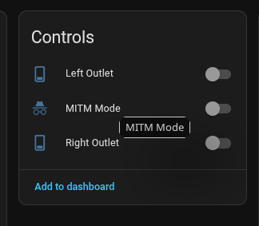

>[!IMPORTANT]
> [DNS redirection REQUIRED](./docs/DNS.md)

# THERE IS NOW A HASS *App* FOR THIS PROJECT!

Huge thanks to [@CodeNeedsCoffee](https://github.com/CodeNeedsCoffee) for the initial work on the App! For the foreseeable future, this project will stick with MQTT. The only way to create HASS devices is MQTT or an integration.

[](https://my.home-assistant.io/redirect/supervisor_add_addon_repository/?repository_url=https%3A%2F%2Fgithub.com%2Fbaudneo%2Fhass-addons)

The existing `python` branch will remain for users who prefer a non HASS App setup. However, docker is required and 
manual installation is no longer officially supported.

>[!WARNING]
> **DO NOT** contact GE / Savant for troubleshooting while using this project, open issues here and tag @baudneo 
> for fast responses.

Async HTTP/MQTT LAN controller for Cync/C by GE devices. **Local** only control
of **most** Cync devices via MQTT JSON payloads following the Home Assistant MQTT JSON schema. 
This project masquerades as the cloud server, allowing you to control your devices locally.

**This is a work in progress, and may not work for all devices.** 
See [known devices](docs/known_devices.md) for more information. Battery powered devices are currently *not* supported due to them being BTLE *send* only.

Forked from [cync-lan](https://github.com/iburistu/cync-lan) and 
[cync2mqtt](https://github.com/juanboro/cync2mqtt) - All credit to 
[iburistu](https://github.com/iburistu) and 
[juanboro](https://github.com/juanboro)

>[!WARNING]
> It is **HIGHLY** recommended that you do **NOT** do any firmware upgrades to Cync devices after running cync-lan. 
> It is extremely (change 1 param in a constructor or config) easy for Savant to disable this method of local control.
> While new methods may restore functionality, I'd rather not go down that route.

## Prerequisites
- Docker
- A minimum of 1, non battery powered, Wi-Fi (*Direct Connect*) Cync / C by GE device to act as the TCP <-> BT bridge (always on)
- Cync account with devices added
- MQTT broker (I recommend EMQX)
- Export devices from the Cync cloud to a YAML file; first export requires account email, password and an OTP emailed to you
  - After configuring and running the container, navigate to http://127.0.0.1:23778 to export devices from the cloud 
- [DNS override/redirection](./docs/DNS.md) for `cm.gelighting.com`, `cm-sec.gelighting.com` or `cm-ge.xlink.cn` to a local host that will run `cync-lan`
- **Optional:** *[Firewall](#firewall) / routing rules to allow cync devices to talk to `cync-lan`* **(VLANs?)**

>[!NOTE]
> You still need to use your Cync account to add new devices as you acquire them.

---

## Installation

See the [installation](./docs/install.md) docs for more information

>[!IMPORTANT]
> After configuring and running the container (but before enabling DNS redirection), you must visit http://localhost:23778 in order to export your Cync 
> devices from the Cync cloud API. Your Cync account creds are set using an env var in the docker-compose.yaml file, 
> the web app will initiate OTP auth and export homes and each homes device list

### Re-routing / Overriding DNS
>[!WARNING] 
> After freshly redirecting DNS: Devices that are currently
> talking to Cync cloud will need to be power cycled before they make
> a DNS request and connect to the local `cync-lan` server.

There are detailed instructions for OPNSense (unbound / dnscrypt-proxy), Pi-hole, Ad-Guard Home and TP-Link Omada SDN. 
See [DNS docs](docs/DNS.md) for more information.

---

## Proxy / MITM mode
As of 0.0.6, there is a proxy/MITM mode that can be enabled to capture the communication between a TCP connected device and the cloud server in real-time. 
This will allow for easier debugging and adding support for new devices and features. A button will be exposed for Cync devices that are connected to CyncLAN via TCP called 'MITM Mode':



### How it works
When you enable MITM mode for a device, the device is disconnected from the `nCync` server and upon reconnection, all of the binary data that the device sends or receives
is proxied to the actual Cync cloud server. The proxied data is logged in real-time to a file and optionally to the console using the `CYNC_MITM_{DEV|APP}_LOGGER` var.

While in MITM mode, the device is not able to be used to control Cync devices from Home Assistant, so it is recommended to have more than 1 TCP device connected to CyncLAN while using MITM mode.
Any device state will be updated in real-time while using MITM mode, we just cant write to the device while in MITM mode. This allows you to use the Cync app to control the device while in MITM mode and see the commands that the cloud server sends to the device.

Currently, only the Cync devices themselves are supported for MITM mode, work is ongoing to also allow proxying the Cync mobile app communication.
Th goal will be to always proxy the app, but only log the proxied data if configured to do so.

### Example log output
The idea is to mimic the socat hex dump format for easy readability and parsing. The data is logged in the format of:
```
2026/05/13 02:18:56.260 [MITM dev:10.0.35.25] < [from_cloud] length=5 from=99204 to=99208
 d8 00 00 00 00                                    .....
--
2026/05/13 02:19:16.674 [MITM dev:10.0.35.25] > [to_cloud] length=5 from=165381 to=165385
 d3 00 00 00 00                                    .....
--
2026/05/13 02:19:16.766 [MITM dev:10.0.35.25] < [from_cloud] length=5 from=99209 to=99213
 d8 00 00 00 00                                    .....
--
2026/05/13 02:19:37.181 [MITM dev:10.0.35.25] > [to_cloud] length=5 from=165386 to=165390
 d3 00 00 00 00                                    .....
--
2026/05/13 02:19:37.262 [MITM dev:10.0.35.25] < [from_cloud] length=5 from=99214 to=99218
 d8 00 00 00 00                                    .....
--
2026/05/13 02:19:53.898 [MITM dev:10.0.35.25] > [to_cloud] length=63 from=165391 to=165453
 43 00 00 00 3a 46 3d 29 20 01 01 06 c7 90 2e 32   C...:F=) ......2
 30 32 36 30 35 31 33 3a 30 32 32 30 3a 2d 33 39   0260513:0220:-39
 2c 30 30 31 37 37 2c 30 30 32 2c 30 30 30 30 30   ,00177,002,00000
 2c 30 30 31 34 39 2c 30 30 30 30 39 2c 7f fe      ,00149,00009,..
--
2026/05/13 02:19:53.981 [MITM dev:10.0.35.25] < [from_cloud] length=8 from=99219 to=99226
 48 00 00 00 03 01 01 00                           H.......
--
```

### Log files
The log files are stored by default in the config dir under `mitm_logs` with the filename format of `{(dev|app)}_{device_(ip|id)}_{date:YMD}.log`. 
The log files are rotated at local midnight and are not deleted by the app at any point, so it is up to the user to manage the log files.

### Workflow
- Enable MITM mode for a device, wait for it to reconnect, it is now being proxied and logged
- Disable Bluetooth and WiFi on your mobile device to force the Cync app to talk to the device via the cloud and thus allowing you to see the commands that the cloud server is sending to the device in real-time in the MITM log output
- Use the Cync app to control the device, observe the current time and note it alongside what command was sent (hvac on, hvac set heat/cool/temp change, dynamic light segment RGB, etc.)
- Allow a 10-15 second window to pass between sending commands to allow easier parsing of the raw data
- Open an issue with the MITM log output and what commands with timestamps, this should allow for adding support for new devices and features without needing to have the device in hand for testing

---

## Tips
See [Tips](docs/tips.md) for more information on how to get the most out of this project.

## Cync Group/Room support
Currently, the only way to interact with cync groups is to target a physical mains powered light switch that is a part of the Cync group/room with the on/off, kelvin or RGB command.
Cync switches are represented as a light in Home Assistant, so you can target the switch with light commands. The Cync group/room that the switch is a part of will change in unison, 
just like they do in the Cync app when you control a group/room, or a physical button press.

This assumes the switch is configured to control Cync devices logically rather than physical switching of the circuit (hasn't been tested with non logical setup).

Also, let me set some expectations:
1. HASS based light groups will always have a delay/popcorn on state changes between each other (set a HASS group of Cync lights green, they don't all change to green at the same time)
2. Custom light scenes/shows; from what I have seen it sends a large stream of binary data to the device (presumably RGB, fade/transition times, etc.) then the device executes the show/scene on a loop based on that data. This will be on the roadmap at some point once things get to a basic stable build of 0.1.0+.

---

## Config file
See the example [config file](./cync_mesh_example.yaml)

### Export config from Cync cloud API
By default, the export webserver is started when cync-lan is. Navigate to http://localhost:23778 to access the export web app.

---

## Env Vars
For the `yes` / `no` value, the user input is cast to a lower case string stripped of spaces:
- Yes answers: "true", "t", "yes", "y", "1", 1, "on", "o"
- No is interpreted as anything other than the yes answers

| Variable                     | Description                                                                                                    | Default                               | Type |
|------------------------------|----------------------------------------------------------------------------------------------------------------|---------------------------------------|------|
| `CYNC_CLOUD_IP`              | IP address of the Cync cloud server (for proxy/MITM mode)                                                      | `34.73.130.191`                       | str  |
| `CYNC_ENABLE_EXPORTER`       | Start the local device export web app                                                                          | `yes`                                 | str  |
| `CYNC_ACCOUNT_USERNAME`      | Cync account username (email) *Required* for the export web app                                                |                                       | str  |
| `CYNC_ACCOUNT_PASSWORD`      | Cync account password *Required* for the export web app                                                        |                                       | str  |
| `CYNC_OVERWRITE_CONFIG_FILE` | On export, overwrite `cync_mesh.yaml` or use a numbered system: `*_1.yaml`, `*_2.yaml`, etc.                   | `yes`                                 | str  |
| `CYNC_MQTT_HOST`             | Host of MQTT broker                                                                                            | `homeassistant.local`                 | str  |
| `CYNC_MQTT_PORT`             | Port of MQTT broker                                                                                            | `1883`                                | int  |
| `CYNC_MQTT_USER`             | Username for MQTT broker                                                                                       |                                       | str  |
| `CYNC_MQTT_PASS`             | Password for MQTT broker                                                                                       |                                       | str  |
| `CYNC_MQTT_CONN_DELAY`       | Delay between MQTT re-connections (seconds)                                                                    | `10`                                  | int  |
| `CYNC_MQTT_DEBUG`            | Override MQTT debug logs (set to no for less debug level log spam)                                             | `yes`                                 | str  |
| `CYNC_APP_MITM_LOGGING`      | Cync mobile apps are always proxied, this controls if the proxied data is logged or not                        | `no`                                  | str  |
| `CYNC_DEBUG`                 | Enable debug logging                                                                                           | `no`                                  | str  |
| `CYNC_RAW_DEBUG`             | Enable raw binary message debug logging                                                                        | `no`                                  | str  |
| `CYNC_MITM_DEV_LOGGER`       | Enable MITM console logging for Cync Devices (enabling this will also output to the console)                   | `no`                                  | str  |
| `CYNC_MITM_APP_LOGGER`       | Enable MITM console logging for mobile APPS (enabling this will also output to the console)                    | `no`                                  | str  |
| `CYNC_DEVICE_CERT`           | Path to cert file                                                                                              | `certs/server.pem`                    | str  |
| `CYNC_DEVICE_KEY`            | Path to key file                                                                                               | `certs/server.key`                    | str  |
| `CYNC_SRV_HOST`              | Interface to listen on                                                                                         | `0.0.0.0`                             | str  |
| `CYNC_PORT`                  | Port to listen for Cync devices (Do NOT change, unless you know what you are doing)                            | `23779`                               | int  |
| `CYNC_EXPORT_HOST`           | Host for export web app                                                                                        | `{CYNC_SRV_HOST}`                     | str  |
| `CYNC_EXPORT_PORT`           | Port for export web app                                                                                        | `23778`                               | int  |
| `CYNC_TOPIC`                 | MQTT topic                                                                                                     | `cync_lan`                            | str  |
| `CYNC_HASS_TOPIC`            | Home Assistant topic                                                                                           | `homeassistant`                       | str  |
| `CYNC_HASS_STATUS_TOPIC`     | HASS status topic for birth / will                                                                             | `status`                              | str  |
| `CYNC_HASS_BIRTH_MSG`        | HASS birth message                                                                                             | `online`                              | str  |
| `CYNC_HASS_WILL_MSG`         | HASS will message                                                                                              | `offline`                             | str  |
| `CYNC_CMD_BROADCASTS`        | Number of WiFi devices to send state *change* commands to (2+ offers noticeable command response improvements) | `2`                                   | int  |
| `CYNC_MAX_TCP_CONN`          | Maximum WiFi devices allowed to connect at a time (keep down log spam, unneccesary load)                       | `8`                                   | int  |
| `CYNC_TCP_WHITELIST`         | Comma separated string of allowed IPs (keep down log spam, unneccesary load, restrict to 'always-on' devices)  | Allow ALL IPs                         | str  |
| `CYNC_BASE_DIR`              | Base directory for **ALL** files.                                                                              | `/root/cync-lan`                      | str  |
| `CYNC_CFGAPPEND_DIR`         | Directory for persistent files (config, uuid, etc.) This is **appended** to `CYNC_BASE_DIR`                    | `/config`                             | str  |
| `CYNC_STATIC_DIR`            | Absolute path to where the index.html and css/js dirs/files are stored                                         | `{CYNC_BASE_DIR}/www`                 | str  |
| `CYNC_CONFIG_DIR`            | Absolute path to where the persistent files are stored (cync_mesh.yaml, uuid.txt and .cloud_auth.yaml)         | `{CYNC_BASE_DIR}{CYNC_CFGAPPEND_DIR}` | str  |

---

## Controlling devices
Devices are controlled by JSON MQTT messages. This was designed to be used 
with Home Assistant, but you can use any MQTT client to send messages 
to the MQTT broker.

**Please see [Home Assistant MQTT documentation](https://www.home-assistant.io/integrations/light.mqtt/#json-schema) 
for more information on JSON payloads.** This repo will try to stay up to
date with the latest Home Assistant MQTT JSON schema.

### Home Assistant
Cync-LAN uses the MQTT discovery mechanism in Home Assistant to 
automatically add devices. You can control the Home Assistant MQTT 
topic via the environment variable `CYNC_HASS_TOPIC` (default: `homeassistant`).

---

## Legacy `socat` based debugging
You can use `socat` to inspect (MITM) the traffic of the device communicating with the 
cloud server in real-time yourself by running:

```bash
# make sure to create the self-signed certs first using the included script (they will be located in ./certs/ dir)
# Older firmware devices
sudo socat -d -d -lf /dev/stdout -x -v 2> dump.txt ssl-l:23779,reuseaddr,fork,cert=certs/server.pem,verify=0 openssl:34.73.130.191:23779,verify=0
# Newer firmware devices (Notice the last IP change)
sudo socat -d -d -lf /dev/stdout -x -v 2> dump.txt ssl-l:23779,reuseaddr,fork,cert=certs/server.pem,verify=0 openssl:35.196.85.236:23779,verify=0
```
In `dump.txt` you will see the back-and-forth communication between the device and the cloud server.
`>` is device to server, `<` is server to device.

### Best `socat` based debugging practices
- spin up vm/lxc so you have 2 `socat` hosts available
- using unbound and its `views` feature to selectively redirect devices to your MITM `socat` machine is a great way to reduce noise in the logs and only capture the traffic of the device you want to add support for
  - allows for only redirecting the device and mobile app to different machines hosting `socat`; see what the mobile app sends and then what the cloud sends to the device
  - the goal is to only have 1 device talking to 1 `socat` instance, so you can easily correlate the logs to the device and not have to sift through a ton of noise from other devices

# Firewall
Once the devices are local, they must be able to initiate a connection to 
the `cync-lan` server. If you block them from the internet, don't forget to 
allow them to connect to the `cync-lan` server (VLANs?).

## OPNsense Example
Please see the [example](./docs/troubleshooting.md#opnsense-firewall-example)
in the troubleshooting docs.

# Power cycle devices after DNS re-route
Devices make a DNS query on first startup (or after a network loss,
like AP reboot) - you need to power cycle all devices that are currently 
connected to the Cync cloud servers before they request a new DNS record 
and will connect to the local `cync-lan` server.

# Troubleshooting
If you are having issues, please see the 
[Troubleshooting docs](docs/troubleshooting.md) for more information.
