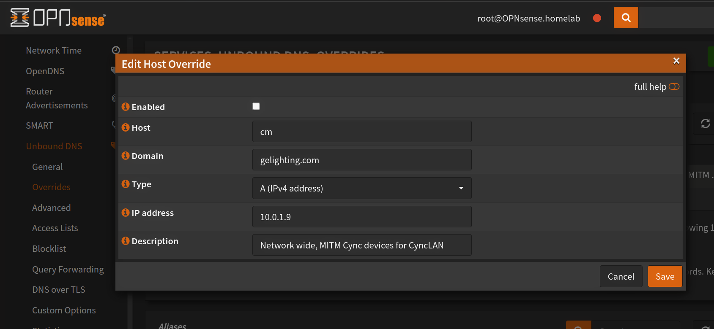
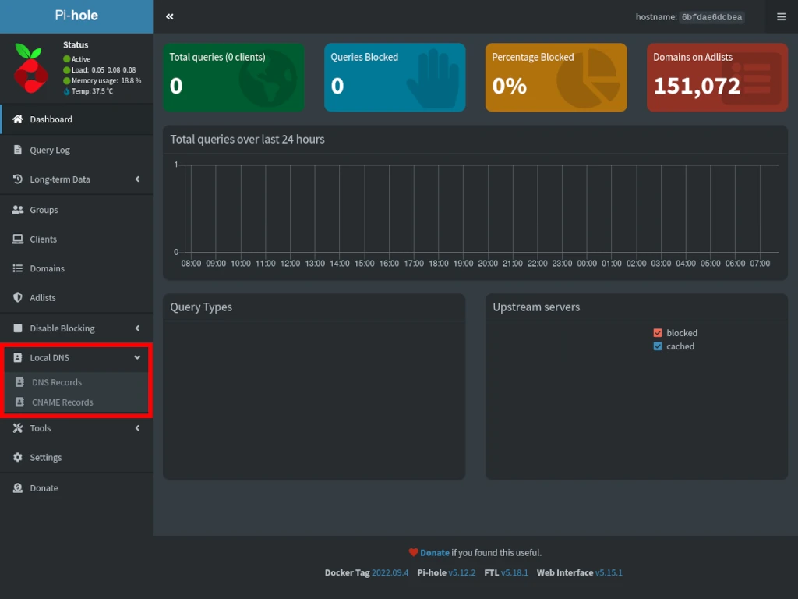
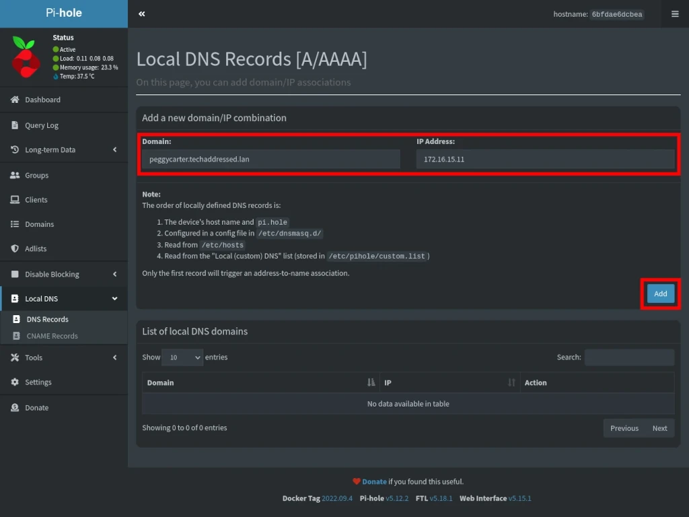
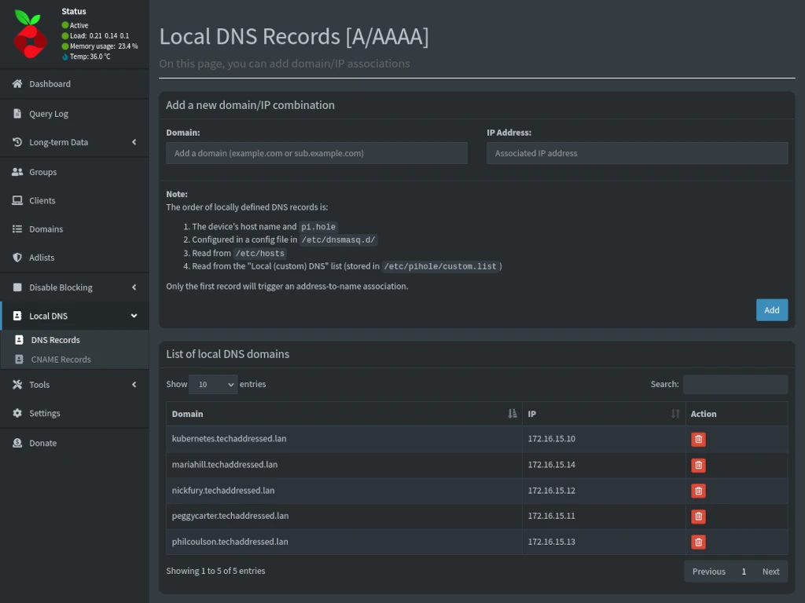

# Firmware differences
:warning: There are changes in newer firmware! :warning: 

Check your DNS logs and search for `xlink.cn`, if you see DNS requests 
then you have some older devices. If you don't see any devices for `xlink.cn` search for `cm.gelighting.com`, 
if you see devices, that's newer firmware (or the Cync app). You may need to redirect both if you have a mix of newer and older firmware.

You need to override the cloud server domain to a local IP on your network. This server masquerades as the cloud TCP server.

Older firmware:
 - `cm-ge.xlink.cn`

Newer firmware:
 - `cm.gelighting.com`


# OPNsense
There are a few different methods using OPNsense depending on your setup. Unbound allows for fine-tuned per 
requesting device IP, DNS redirection.

## Unbound DNS
To perform domain level DNS redirection (all devices that request `cm.gelighting.com` will be redirected)

- Go to `Services`>`Unbound DNS`>`Overrides`.

- Create a new override for `cm.gelighting.com` or `cm-ge.xlink.cn` and point it to your local server.

- Click Save.
- Power cycle cync devices.

### Selective DNS routing
**Selective DNS routing means, only certain devies will have their DNS redirected, the rest of your network will not have their DNS redirected for thsoe specific domains**

You can use `views` to selectively route DNS requests based on the requesting device. 

The following example will reroute DNS requests for `cm.gelighting.com` `10.0.1.9` **only for devices** `10.0.1.167` and `10.0.1.112`.
`local-zone` is your DNS domain (.local, .lan, .whatever). Notice there is no `.`!!.

- First disable domain level redirection if you have already configured it. (all devices requesting a domain get redirected)
- Go to `Services`>`Unbound DNS`>`Custom Options`.

- Enter the data, click Save, go back to `Services`>`Unbound DNS`>`General` and restart unbound by clicking the button beside the green arrow.

- Power cycle cync devices.

:warning: NOTICE the trailing `.` after `cm.gelighting.com.` in `local-data:`. :warning:

```
server:
access-control-view: 10.0.1.167/32 cync-override
access-control-view: 10.0.1.112/32 cync-override
view:
name: "cync-override"
local-zone: "homelab" static
local-data: "cm.gelighting.com. 90 IN A 10.0.1.9"
```

# DNSCryptProxy
As far as I know, you can only override a domain network wide, not selectively by device.

- Go to `Services`>`DNSCryptProxy`>`Configuration`.
- Click on the `Overrides` tab.

- Add overrides

- Click Save.
- Power cycle cync devices.


# Pi-hole
*This example was pulled from [techaddressed](https://www.techaddressed.com/tutorials/using-pi-hole-local-dns/)*

As far as I know, Pi-Hole does not support selective DNS routing, only network wide.

- Left side navigation menu, click **Local DNS** to expand **DNS Records** and **CNAME Records**. 
- Select `DNS Records`.


- Enter `cm.gelighting.com` or `cm-ge.xlink.cn` in **Domain**.
- Enter the IP of the machine that will be running cync-lan in **IP Address**. 
- Click the *Add* button.


- Your local DNS records will appear under the **List of local DNS domains** – as shown below.


- Test the DNS record by running `dig cm.gelighting.com` or `dig cm-ge.xlink.cn` from a device on your network.
```bash
❯ dig cm.gelighting.com

; <<>> DiG 9.18.25 <<>> cm.gelighting.com
;; global options: +cmd
;; Got answer:
;; ->>HEADER<<- opcode: QUERY, status: NOERROR, id: 36051
;; flags: qr aa rd ra; QUERY: 1, ANSWER: 1, AUTHORITY: 0, ADDITIONAL: 1

;; OPT PSEUDOSECTION:
; EDNS: version: 0, flags:; udp: 1232
;; QUESTION SECTION:
;cm.gelighting.com.             IN      A

;; ANSWER SECTION:
cm.gelighting.com.      3600    IN      A       10.0.1.14

;; Query time: 0 msec
;; SERVER: 10.0.1.1#53(10.0.1.1) (UDP)
;; WHEN: Mon Apr 01 18:53:29 MDT 2024
;; MSG SIZE  rcvd: 62
```
In the example above, `cm.gelighting.com` returns `10.0.1.14` which is the IP address of the machine running cync-lan. 
After power cycling Cync devices, the devices will start trying to connect to `10.0.1.14`.

:warning: **Don't forget to power cycle all your Wi-Fi Cync devices** :warning: