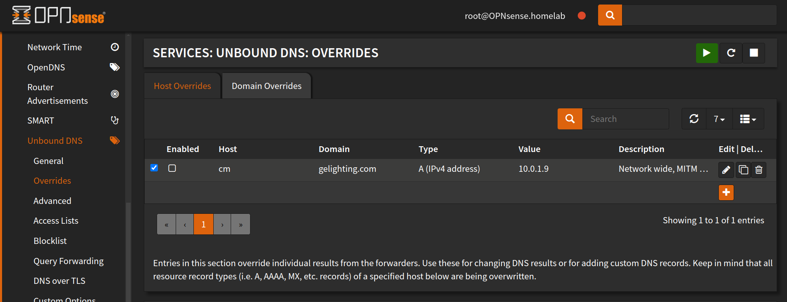
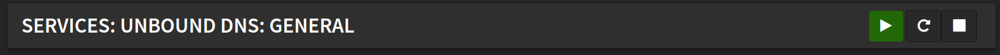

# Firmware differences
:warning: There are changes in newer firmware! :warning: 

Check your DNS logs and search for `xlink.cn`, if you see DNS requests 
then you have some older devices. If you don't see any devices for `xlink.cn` search for `cm.gelighting.com`, 
if you see devices, that's newer firmware (or the Cync app). You may need to redirect both if you have a mix of newer and older firmware.

You need to override the cloud server domain to a local IP on your network. This server masquerades as the cloud TCP server.

Older firmware:
 - `cm-ge.xlink.cn`

Newer firmware:
 - `cm.gelighting.com`


# OPNsense
There are a few different methods using OPNsense depending on your setup. Unbound allows for fine-tuned per 
requesting device IP, DNS redirection.

## Unbound DNS
To perform domain level DNS redirection (all devices that request `cm.gelighting.com` will be redirected)

- Go to `Services`>`Unbound DNS`>`Overrides`.

- Create a new override for `cm.gelighting.com` or `cm-ge.xlink.cn` and point it to your local server.

- Click Save.
- Power cycle cync devices.

### Selective DNS routing
You can use `views` to selectively route DNS requests based on the requesting device. 

The following example will reroute DNS requests for `cm.gelighting.com` to `10.0.1.9` for devices `10.0.1.167` and `10.0.1.112`.
`local-zone` is your DNS domain (.local, .lan, .whatever). Notice there is no `.`!!.

- First disable domain level redirection if you have already configured it. (all devices requesting a domain get redirected)
- Go to `Services`>`Unbound DNS`>`Custom Options`.

- Enter the data, click Save, go back to `Services`>`Unbound DNS`>`General` and restart unbound by clicking the button beside the green arrow.

- Power cycle cync devices.

:warning: NOTICE the trailing `.` after `cm.gelighting.com.` in `local-data:`. :warning:

```
server:
access-control-view: 10.0.1.167/32 cync-override
access-control-view: 10.0.1.112/32 cync-override
view:
name: "cync-override"
local-zone: "homelab" static
local-data: "cm.gelighting.com. 90 IN A 10.0.1.9"
```

# DNSCryptProxy
As far as I know, you can only override a domain network wide, not selectively by device.

- Go to `Services`>`DNSCryptProxy`>`Configuration`.
- Click on the `Overrides` tab.

- Add overrides

- Click Save.
- Power cycle cync devices.


# Pi-hole
**Please contribute to this section if you have a Pi-hole!**